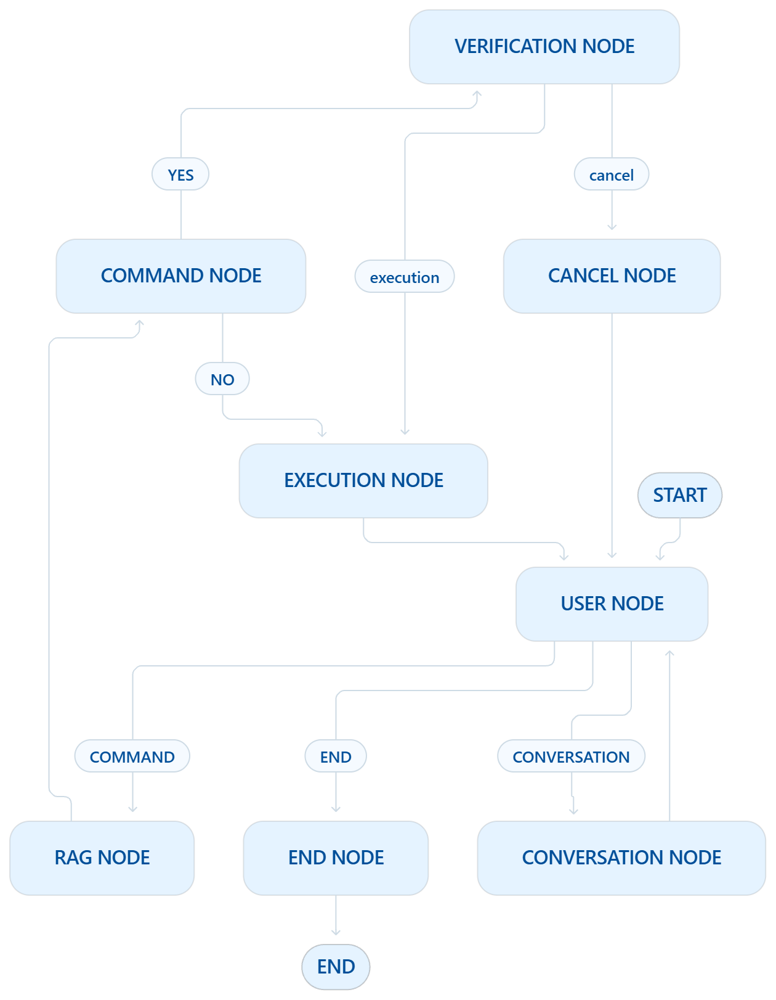

# 🎙️ Voice-Driven Agentic AI for Autonomous OS Automation

A general-purpose, voice-controlled Windows automation agent that uses an LLM to interpret natural-language requests, retrieve relevant Windows command knowledge through RAG, generate executable system commands, verify potentially sensitive actions, and execute them through a controlled LangGraph workflow.

---

## 📌 Table of Contents

- [Problem \& Solution](#problem--solution)
- [Architecture](#architecture)
- [Workflow](#workflow)
- [Conditional Edges](#conditional-edges)
- [Nodes](#nodes)
  - [User Node](#user-node)
  - [Conversation Node](#conversation-node)
  - [RAG Node](#rag-node)
  - [Command Node](#command-node)
  - [Verification Node](#verification-node)
  - [Execution Node](#execution-node)
  - [Cancel Node](#cancel-node)
  - [End Node](#end-node)
- [Technology Stack](#technology-stack)

---

## Problem & Solution

Conventional voice automation systems are typically limited to predefined commands, fixed application mappings, or task-specific actions. This limits their ability to handle flexible natural-language instructions across heterogeneous operating-system tasks.

This project addresses that limitation with an **agentic LLM workflow** where the user's spoken request is interpreted dynamically. The agent:

1. Determines whether the input is a command, conversation, or termination request
2. Retrieves relevant Windows documentation when required
3. Generates the appropriate command
4. Evaluates whether confirmation is necessary
5. Executes the action while maintaining the interaction flow

---

## Architecture



---

## Workflow

```text
START
  │
  ▼
USER NODE
  │
  ├── END ───────────────► END NODE ─► END
  │
  ├── CONVERSATION ──────► CONVERSATION NODE ──► USER NODE
  │
  └── COMMAND ───────────► RAG NODE
                              │
                              ▼
                         COMMAND NODE
                              │
                              ▼
                     Verification Required?
                        ┌──────┴──────┐
                       YES            NO
                        │              │
                        ▼              ▼
               VERIFICATION NODE   EXECUTION NODE
                        │              │
                  User Response    Result + TTS
                   ┌────┴────┐
                  YES         NO
                   │           │
                   ▼           ▼
             EXECUTION      CANCEL NODE
                NODE            │
                   │            │
                   └─────┬──────┘
                         ▼
                     USER NODE
```

---

## Conditional Edges

The graph doesn't move linearly — three routing points decide where execution goes next based on LLM-classified state rather than a fixed path.

**`route_request` (after User Node)**
Reads `intent` off the state and branches the graph three ways:

| Return value | Destination |
|---|---|
| `"end"` | End Node |
| `"command"` | RAG Node |
| `"conversation"` | Conversation Node |

**`verification_router` (after Command Node)**
Asks the LLM whether the generated command is safe to run unattended or needs a human in the loop, then routes accordingly:

| Return value | Destination |
|---|---|
| `"verification"` | Verification Node |
| `"execution"` | Execution Node |

**`verification_decision` lambda (after Verification Node)**
Once the user has responded to the confirmation prompt, this edge reads the `verification_decision` field set by the Verification Node and sends the flow to whichever branch matches:

| Return value | Destination |
|---|---|
| `"execution"` | Execution Node |
| `"cancel"` | Cancel Node |

All three routers keep the same shape: an LLM call produces a single classification, the classification is normalized, and `add_conditional_edges` maps it to the next node. This is what lets the agent decide, at every step, whether to keep talking, retrieve documentation, ask for confirmation, execute, or stop — instead of following one fixed sequence.

---

## Nodes

### User Node
Captures fresh voice input, converts speech to text, and classifies the latest request into:

| Classification | Description |
|---|---|
| `END` | Terminate the agent |
| `COMMAND` | Perform a Windows/OS operation |
| `CONVERSATION` | Handle the request as normal dialogue |

Classification is performed independently for every new user input, while session history is retained for conversational context.

### Conversation Node
Processes non-operational requests using the LLM and the maintained session history. It generates a natural-language response and returns control to the **User Node** for the next interaction.

### RAG Node
Retrieves relevant Windows command and system documentation using **Tavily**, primarily from Microsoft documentation. Retrieved information is supplied as supporting context to the command-generation stage rather than replacing the LLM's own knowledge.

### Command Node
Converts the natural-language command request and retrieved documentation into **one executable Windows CMD command**. The node dynamically generates the command at runtime instead of relying on predefined application mappings.

### Verification Node
Handles human confirmation for commands identified as potentially sensitive or destructive. It asks the user for confirmation through voice input and uses the LLM to interpret the complete response — allowing acceptance, rejection, cancellation, or ambiguous statements to be understood semantically.

### Execution Node
Executes the generated Windows command and captures its output, errors, return status, and timeout conditions. The execution result is then interpreted by the LLM into a concise response, delivered to the user through text-to-speech before returning to the **User Node**.

### Cancel Node
Terminates the pending operation when the user rejects or does not clearly confirm a verification request, then returns control to the **User Node**.

### End Node
Provides the final voice response and terminates the agent workflow.

---

## Technology Stack

| Component | Purpose |
|---|---|
| **Python** | Core implementation and Windows system interaction |
| **LangGraph** | Stateful agent workflow and conditional node routing |
| **LangChain** | LLM integration, prompts, tools, and agent components |
| **Qwen3-235B-A22B-Instruct-2507** | Primary LLM for intent classification, command generation, verification interpretation, and response generation |
| **Hugging Face** | LLM endpoint integration |
| **Tavily Search & Extract** | Retrieval of relevant Windows command documentation |
| **SpeechRecognition** | Voice-to-text input |
| **pyttsx3** | Text-to-speech output |
| **subprocess** | Controlled Windows command execution |
| **Jupyter Notebook** | Development and experimental environment |
